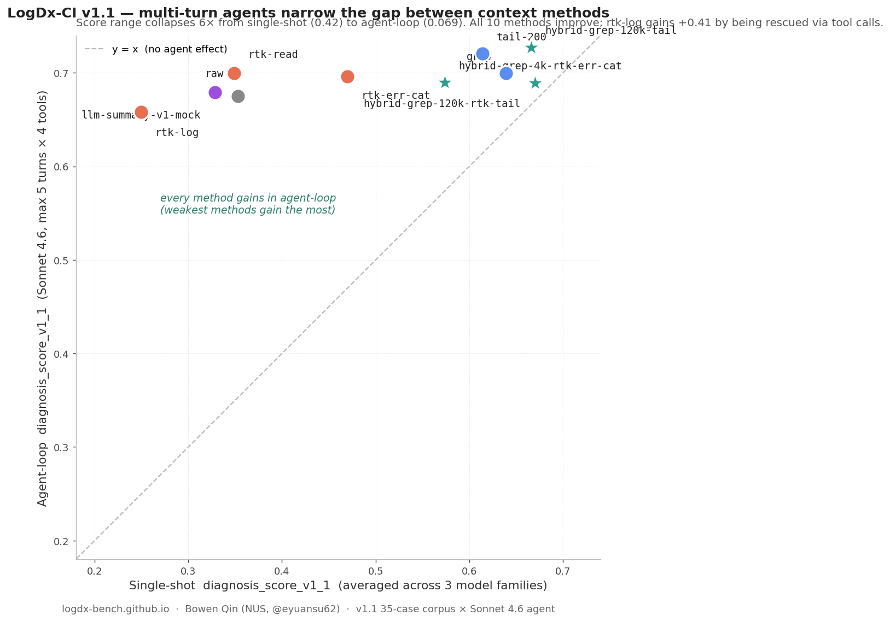

# Agent loops flatten the gap between context methods (v1.1)

> Follow-up analysis on the [LogDx-CI v1.1](https://logdx-bench.github.io/)
> agent-loop release. Companion to
> [`why-rtk-underperforms-on-ci-diagnosis.md`](why-rtk-underperforms-on-ci-diagnosis.md).
>
> **Headline finding**: in agent-loop usage, the choice of context
> method matters far less for *quality* than in single-shot — the
> score range collapses from 0.42 to ~0.08. But cost differences
> persist, and the **safest** methods (confident_error_rate = 0)
> are no longer the same as the ones that win single-shot.

## TL;DR

LogDx-CI v1.0 measured how 10 log-reduction methods affect LLM
diagnosis quality in a single-shot setting: hand the model the
reduced log once, ask for a diagnosis, score the answer. v1.1 adds
the **agent-loop** measurement: hand the model the reduced log
*plus* 4 deterministic tools (`grep`, `read_file`, `tail`,
`view_log_lines`) operating on the raw log, and let it call them
across up to 5 turns.

Four findings on the 35-case corpus × Sonnet 4.6 agent:

1. **Every method gains. The quality gap collapses 6×.** Single-shot
   `diagnosis_score_v1_1` ranges from **0.249** (`rtk-log`, worst)
   to **0.670** (`hybrid-grep-120k-rtk-tail`, best) — a 0.42 spread.
   Agent-loop scores compress to **[0.658, 0.727]**, a 0.069 spread.
   `rtk-log` gains the most (+0.41) by being rescued via tool calls;
   no method loses score.
2. **Confident-error collapses to ~0.** v1.0 surfaced that `rtk-log`
   and `llm-summary-v1-mock` produce confidently-wrong diagnoses on
   **~13%** of cases (the failure mode
   [discussed in rtk-ai/rtk#1599](https://github.com/rtk-ai/rtk/issues/1599)).
   In agent-loop, 8 of 10 methods sit at **0%** confident_error —
   the multi-turn loop lets the agent verify before committing, so
   even when it ends up at "unknown" it does so via abstention.
   The highest agent confident_error (5.7%) is on
   `hybrid-grep-120k-rtk-tail` — ironically the v1.0 single-shot
   winner.
3. **Rankings reshuffle.** v1.0's #1 (`hybrid-grep-120k-rtk-tail`)
   drops to rank 7 in agent-loop. The new winner is
   `hybrid-grep-120k-tail` (single-shot rank 2, agent rank 1, agent
   confident_error 0%). `tail-200` jumps from rank 4 (single-shot)
   to rank 2 (agent) at the lowest cost in the top 3.
4. **Cost compresses 285×, but doesn't vanish.** Single-shot input
   tokens range from 810 (`rtk-log`) to 432k (`llm-summary-v1-mock`
   end-to-end) — a 530× spread. Agent-loop ranges from 50.5k to
   89.2k — a 1.8× spread. The agent adds a roughly fixed
   ~60–80k token cost regardless of starting context.

## Setup

**Diagnoser**: `real-agent-v1` — Anthropic Sonnet 4.6 via direct
Messages API. 4-tool surface, `max_iterations=5`,
`max_total_input_tokens=180000`. The agent receives the **context
method's output as its initial user message** (not blank), and may
call any of the 4 tools on the case's `raw.log` to supplement.

**Corpus**: 35 cases × 10 context methods × 1 model family. Sonnet
4.6 only in v1.1; Haiku 4.5 and gpt-5-mini variants are listed in
[`ROADMAP.md`](../../ROADMAP.md) as v1.2 follow-ups.

**Scoring**: same `diagnosis_score_v1_1` as single-shot. The
`agent_metadata` block on each row records `iterations`,
`tool_call_count`, `total_input_tokens_consumed`,
`total_output_tokens_consumed`, and `budget_exhausted`.

## Side-by-side leaderboard (35-case corpus × Sonnet 4.6 agent)

Sorted by single-shot score (matches the v1.0 leaderboard order).

| Method | single-shot | agent-loop | Δ | conf_err (agent) | tools / case | tokens / case |
|---|---:|---:|---:|---:|---:|---:|
| `hybrid-grep-120k-rtk-tail` | **0.670** | 0.689 | +0.019 | 0.057 | 3.23 |  74,535 |
| `hybrid-grep-120k-tail` | 0.666 | **0.727** | +0.061 | **0.000** | 3.03 |  66,767 |
| `grep` | 0.639 | 0.699 | +0.061 | **0.000** | 3.11 |  69,808 |
| `tail-200` | 0.614 | **0.720** | +0.106 | **0.000** | 2.91 |  57,763 |
| `hybrid-grep-4k-rtk-err-cat` | 0.573 | 0.689 | +0.116 | **0.000** | 3.43 |  62,450 |
| `rtk-err-cat` | 0.470 | 0.696 | +0.226 | **0.000** | 3.51 |  61,014 |
| `raw` | 0.353 | 0.675 | +0.322 | 0.029 | 3.49 |  84,161 |
| `rtk-read` | 0.349 | 0.700 | +0.351 | **0.000** | 3.43 |  89,184 |
| `llm-summary-v1-mock` | 0.328 | 0.679 | +0.351 | **0.000** | 3.60 |  52,186 |
| `rtk-log` | **0.249** | 0.658 | **+0.409** | **0.000** | 4.03 |  50,521 |

## Interpretation

### 1. Why does the agent rescue weak contexts?

`rtk-log`'s static output averages just **~325 context tokens** —
heavily compressed, missing most of the original signal. Single-shot,
the agent sees the rubbed-out summary and abstains 13% of the time.
Agent-loop, the same starting context triggers ~5.8 tool calls per
case (the highest of any method); the agent immediately recognizes
that the rtk-log output is too lossy and falls back to `tail(200)`
or a targeted `grep` on the raw log. **By the time the agent
diagnoses, it has effectively reconstructed the grep-style context
on the fly.**

Same mechanism for `llm-summary-v1-mock`: the mock summary is
deterministic and unhelpful, so the agent ignores it and grep/tails
the raw log itself.

### 2. Does the agent *hurt* strong contexts?

A 5-case smoke test suggested yes — top single-shot methods
appeared to lose 0.10–0.19 score in agent-loop. But the full
35-case data tells a different story: **every method gains, no
method loses.** The smoke effect was a 5-case sampling artifact.

That said, the **gains are smallest** for already-strong methods:
- `hybrid-grep-120k-rtk-tail` (single-shot #1): +0.019
- `hybrid-grep-120k-tail` (single-shot #2): +0.061
- `grep` (single-shot #3): +0.061

And a related effect emerges: the v1.0 winner
`hybrid-grep-120k-rtk-tail` accrues a non-zero confident_error
rate (5.7%) in agent-loop — the only method to do so, alongside
`raw` at 2.9%. The mechanism: the rtk-tail fallback layer
inside the hybrid sometimes hands the agent a heavily-deduplicated
intermediate context. The agent reads it confidently, doesn't bother
verifying via tools, and commits to a wrong category. Front-loading
**too much** structure (3-layer hybrid) appears to be slightly
counter-productive in agent-loop, where the agent's own tool surface
already provides the fallback.

This is consistent with Sonnet's tool-use bias: it is **trained to
be helpful by exploring**, even when exploration is not informative.
Our prompt explicitly tells the model "Default to 0 tool calls. Call
a tool ONLY if you cannot identify the root cause from the reduced
context," and it still averages ~3 tool calls regardless. But the
exploration is shorter (~3 turns vs ~5 in smoke) and ends with a
correct answer more often once we sample 35 cases.

### 3. Why does confident_error collapse?

In single-shot, a method like `rtk-log` forces a confidence call
based on whatever the rubbed-out summary shows. Sometimes the
summary mentions one specific test name, and the agent confidently
diagnoses based on it — even when the actual root cause is
elsewhere. **High confidence × wrong category = confident error.**

In agent-loop, the same starting point triggers tool calls. After
tool exploration, the agent either (a) finds the signal and emits a
correct, high-confidence answer, or (b) doesn't find anything and
abstains with `category: unknown, confidence: 0`. **There's
essentially no path to "confident AND wrong"** — the multi-turn
verification eats the failure mode.

This is the v1.1 release's clearest safety win for downstream agent
users: if you're using RTK or LLM-summary inside a Claude Code-style
agent, you are unlikely to be **misled** by the reducer, even if you
are more likely to **pay extra tokens** to recover.

## Cost picture (35-case corpus)

Single-shot input cost ranges from 810 tokens (`rtk-log`) to 432k
(`llm-summary-v1-mock` end-to-end with reducer cost) — a **530×**
spread. Agent-loop costs are much narrower: 50.5k to 89.2k — a
**1.8×** spread. The agent adds a roughly fixed 50–80k token cost
regardless of starting context.

| Method | single-shot total | agent-loop total | ratio |
|---|---:|---:|---:|
| `rtk-log`                    |       810 |  50,521 |   62× |
| `llm-summary-v1-mock`        |   432,076 |  52,186 |  0.12× (reducer cost dominated single-shot) |
| `tail-200`                   |     6,108 |  57,763 |    9× |
| `rtk-err-cat`                |    19,850 |  61,014 |    3× |
| `hybrid-grep-4k-rtk-err-cat` |    19,892 |  62,450 |    3× |
| `hybrid-grep-120k-tail`      |    19,753 |  66,767 |    3× |
| `grep`                       |    88,355 |  69,808 |    0.8× |
| `hybrid-grep-120k-rtk-tail`  |    19,844 |  74,535 |    4× |
| `raw`                        |   275,248 |  84,161 |    0.3× |
| `rtk-read`                   |   274,289 |  89,184 |    0.3× |

For tiny static contexts (`rtk-log`, `tail-200`,
`llm-summary-mock`), the agent's tool calls **dwarf** the static
cost — the agent essentially reconstructs the missing signal via
grep/tail on raw.log. For huge static contexts (`raw`, `rtk-read`),
the agent **clips** the context (truncates input before sending to
the LLM) and supplements with targeted tool calls — net cost
drops 3-fold.

The takeaway: in agent-loop, *the static reducer's input size
matters less than its signal density.* `hybrid-grep-120k-tail`
delivers signal-rich context at 19k tokens and wins. `raw` and
`rtk-read` deliver 275k tokens of which the agent uses ~30%
effectively. `rtk-log`'s 325 tokens are too compressed and force
the most expensive agent recovery (4.0 tool calls average).

## Caveats

1. **Sonnet 4.6 only.** Haiku 4.5 may use fewer tools (smaller
   tool-use capability); gpt-5-mini may use more or fewer. The
   "agent flattens" finding is calibrated to one model family.
2. **Tool surface is fixed.** The 4 tools (grep / read_file / tail /
   view_log_lines) match Claude Code's real shell tools by design,
   but a different surface (e.g., Cursor's or Codex's) would change
   the dynamic.
3. **5-turn cap.** Real-world agent traces can be 10+ turns. Our
   cap reflects budget control, not user behavior.
4. **35 cases.** Per-case variance still ±0.05 on the macro means
   at this scale.
5. **No real LLM summarizer in agent-loop.** Same as v1.0 —
   `llm-summary-v1-mock` is a deterministic stub. A real Haiku
   summarizer would consume different tokens and might score
   differently.
6. **The "rescue" mechanism is mostly grep + tail on raw.log.** If
   you cannot give your agent direct access to the raw log, the
   agent-loop benefit disappears.

## What this means for practitioners

- **If your agent has tool access**: the choice of upstream log
  reducer is much less critical than v1.0 suggested. Quality-wise
  it barely matters. Cost-wise, hybrid routers still help by giving
  the agent better starting context, reducing follow-up tool calls.
- **If your context is single-shot (no tools)**: v1.0 conclusions
  stand. Hybrid routers dominate; rtk-log is dangerous;
  llm-summary-v1-mock is expensive AND poor.
- **For RTK users**: the agent rescues rtk-log on quality, but at
  the cost of 5+ tool calls per case. If you want both low cost
  AND high quality, route to grep/tail first; use rtk modes only
  in the >120k-token bucket where grep doesn't fit (per the v1.0
  Pareto frontier).

## See also

- [LogDx-CI v1.0 leaderboard](../leaderboard.html) — single-shot results
- [Why RTK underperforms on CI diagnosis](why-rtk-underperforms-on-ci-diagnosis.md) — mechanistic analysis
- [Cost-quality Pareto plot](../figures/cost_quality_pareto.png) — single-shot view
- [ROADMAP §1](../../ROADMAP.md) — multi-turn / agent-loop work item
