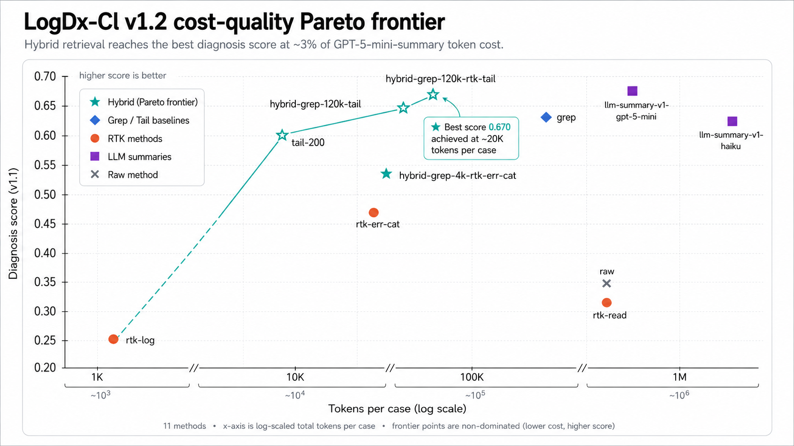

# LogDx-CI v1.2 — Technical Report

**Benchmarking CI Log Reduction Tools for LLM Root-Cause Diagnosis**

*Bowen Qin · National University of Singapore*

> v1.2 (preprint) · 35 cases × 11 context providers × 3 LLM families ·
> Code & data: <https://github.com/eyuansu62/LogDx>

---

## Abstract

CI failure logs are large (median 5k lines, max 200k in this corpus) and
noisy. Coding agents that try to debug them — Claude Code, Codex,
Cursor — depend on an upstream tool to reduce the log to a manageable
context. Different tools (RTK, grep, tail, LLM summarizers, hybrid
routers) preserve different signals.

LogDx-CI benchmarks **11 context-reduction tools** on **35 real GitHub
Actions failure cases**, scored by **3 LLM debugger families** (Claude
Haiku 4.5, Claude Sonnet 4.6, OpenAI gpt-5-mini) plus a Sonnet 4.6
tool-using agent (`real-agent-v1`, 4 tools, 5-turn cap). The benchmark
optimizes for **method ranking stability across model families**, not
"which LLM scored highest."

Three load-bearing findings:

1. **Hybrid grep+tail routers dominate the cost-quality Pareto
   frontier.** Top-2 (`hybrid-grep-120k-rtk-tail`,
   `hybrid-grep-120k-tail`) score 0.670 / 0.666 at ~$0.03/case
   end-to-end — same-ballpark quality as `grep` at 4.5× fewer tokens.
2. **The agent-loop quality range collapses 7× across reduction
   tools** (single-shot spread 0.42 → agent-loop spread 0.059). The
   tool-using agent rescues weak contexts via follow-up tool calls.
   But **cost differences persist** in agent-loop: weak contexts
   force the agent to issue 2-4× more tool calls to recover
   (`rtk-log` uses 2.60 tools/case; the top hybrid uses 0.97).
   Reducer choice still matters — just via cost, not quality.
3. **Cross-family LLM-summary beats same-family by +0.071** (v1.2's
   headline). A real OpenAI gpt-5-mini map-reduce summarizer feeding
   a Claude Haiku debugger outscores the same-family Haiku→Haiku
   pair on three of four diagnoser variants. The self-call-bias
   hypothesis (that LLM-as-judge eval inflates same-family scores
   via shared priors) is **falsified** for this task. The
   gpt-5-mini summarizer is also the v1.2 agent-loop #1 at score
   0.749, with the lowest tool-call count (0.37/case) and 10×
   lower reducer cost than the Haiku summarizer ($0.18 vs $1.75
   per case).

All data, code, per-case bundles, and reproducibility infrastructure
are public under Apache-2.0 (code) and CC-BY-4.0 (data).

---

## 1. Introduction

### What this benchmark measures

LogDx-CI evaluates **whether a log reduction tool preserves enough
evidence for an LLM to identify the root cause of a CI failure**. The
pipeline is:

```text
raw CI log
  → context method (one of 11 reduction tools)
  → debugger LLM (one of 3 families) or tool-using agent
  → diagnosis JSON
  → deterministic evaluator → diagnosis_score_v1_1
```

The corpus is real public GitHub Actions failures across 8 categories
and 7+ ecosystems. Ground truth is AI-drafted (Claude Opus 4.7) +
single-author verified.

### Why this matters

CI failure logs in this corpus range from 27 lines to 200k+, with a
median around 5k. Most exceed the effective input window of even
long-context models once tool definitions, system prompts, and
reasoning overhead are accounted for. A reduction step is therefore
nearly mandatory in production agent stacks (Claude Code, Codex,
Cursor all ship some form of it), but the field has had no public
empirical comparison of which reductions preserve enough evidence
for downstream LLM diagnosis. This benchmark closes that gap.

### Scope

This is a **niche benchmark**, not a general agent evaluation. It does
not measure: general coding ability, multi-step planning, repository
navigation, or open-ended debugging. Findings should not be
extrapolated beyond "single-LLM-call or 5-turn-agent diagnosis of a
single CI failure log."

---

## 2. Related Work

### Coding-agent benchmarks

The dominant benchmark for LLM-based software engineering is
**SWE-bench** (Jimenez et al., 2024), which measures whether an agent
can resolve real GitHub issues by editing a repository, with
extensions such as SWE-bench Verified (human-verified subset) and
SWE-bench Multimodal. **Terminal-Bench** measures agent task
completion in a terminal environment, a closer analog to our
CI-failure-diagnosis setting but optimizing for end-to-end task
success rather than diagnostic accuracy. **WebArena** and **OSWorld**
benchmark agents in web and OS environments respectively. None of
these benchmarks isolate the **context-reduction step** that precedes
LLM diagnosis — the upstream tool that selects what evidence reaches
the model is treated as opaque infrastructure. We measure this step
directly.

### LLM-as-judge evaluation

Many recent benchmarks rely on LLMs to score outputs: **MT-Bench**
and **Chatbot Arena** (Zheng et al., 2023), **AlpacaEval** (Li et
al., 2023), **G-Eval** (Liu et al., 2023), and **RAGAS** (Es et al.,
2023) for retrieval-augmented generation. Several biases complicate
this approach. Zheng et al. (2023) document **self-enhancement bias**
(models prefer their own outputs in pairwise comparison) and
**position bias** (the first response wins in pairwise judging
disproportionately often). Our §4.5 measurement extends this
literature with a different bias variant: whether a **summarizer +
downstream judge of the same vendor family** produces inflated scores
via shared priors. We find this **family-self-call bias is not
present** on our task; cross-family pairs beat same-family by +0.071
on average across diagnoser variants.

### Log compression and parsing

Classical log-parsing work (**Drain**, He et al., 2017; **Spell**, Du
& Li, 2016; **LogPAI** and **LogHub**, Zhu et al., 2019) optimizes
log compression for *storage and human search*. Our work differs in
the objective function: we measure **how much of the failure signal
survives** various log-reduction strategies as judged by downstream
LLM diagnostic ability, rather than measuring compression ratio or
human-search recall. The **RTK** tool (rtk-ai/rtk), which is a
primary baseline in our benchmark, is an open-source context-
reduction CLI without a published benchmark of its CI-debugging
effectiveness — this benchmark is, in part, that missing measurement.

### Context selection for LLMs

A growing literature studies how LLM performance degrades with
context size and content structure: **lost-in-the-middle** (Liu et
al., 2024) shows that LLMs underweight information in the middle of
long inputs. **Self-RAG** (Asai et al., 2024) adds reflection to
retrieval-augmented generation. Our hybrid routers — the top-2
baselines on this benchmark — are a particularly simple instance of
this design space: a 120k-token threshold rule that empirically
identifies the abstain cliff for Sonnet 4.6 and Haiku 4.5 on this
corpus, with a deterministic fallback to `tail-200`. The 7×
quality-range collapse in agent-loop (§4.4) is consistent with
recent findings that tool-use rescues weak retrieval (cf. Self-RAG)
in agent settings.

References for all cited works appear in [§10](#10-references).

---

## 3. Methodology

### 3.1 Corpus

35 real GitHub Actions failure cases across 6 splits:

| Split        | Cases | Wave |
|--------------|------:|------|
| `dev`        |     5 | v1 (prototype) |
| `holdout`    |     5 | v1 (prototype) |
| `stress`     |     6 | v1 (prototype) |
| `v2/dev`     |     3 | v2 (formal) |
| `v2/holdout` |    10 | v2 (formal) |
| `v2/stress`  |     6 | v2 (formal) |
| **Total**    | **35** | |

Coverage:

- **8 failure categories**: `test_assertion`, `compile_error`,
  `type_error`, `lint_failure`, `dependency_install`, `docker_build`,
  `timeout_or_oom`, `multi_failure`
- **7+ ecosystems**: pytest, cargo, `go test`, Maven, pnpm + jest,
  docker buildx, helm/k8s, terraform, gradle, biome, mypy, tsc, etc.
- **Log sizes**: 27 lines (smallest) to 200k+ (largest in v2/stress)

Each case carries five files under `cases/<split>/<case_id>/`:
`raw.log`, `case.json` (metadata), `ground_truth.json` (root cause,
required signals, relevant files/tests, must-mention checklist,
forbidden claims), `tags.json` (ecosystem, language, signal-position,
evidence formats, multi-failure flag), and `privacy_audit.json`
(redaction trail).

Logs are sourced from publicly visible GitHub Actions runs. Each
passed through `tools/audit_context_privacy.py` (200k-line cap,
fail-closed on truncation, URL/bearer/API-key/long-opaque-token
redactors) before commit. Zero redaction hits across all 35 cases.

### 3.2 Evaluation metric

The primary metric `diagnosis_score_v1_1` is a calibrated linear
combination of:

- Category accuracy (does the diagnosis name the right failure
  category?)
- Required-signal recall (did it mention the must-have signals?)
- Relevant-file and relevant-test recall
- Must-mention coverage from the ground-truth checklist
- Valid-evidence-quote rate (does the diagnosis cite actual lines
  from the log?)

Penalized for:

- Forbidden claims (asserting things the log doesn't support)
- Confident errors (`confidence ≥ 0.70` AND demonstrably wrong on
  multiple fronts — the metric closest to "this method led the LLM
  to confidently misdiagnose")

Weights and calibration: `docs/evaluation/diagnosis_eval_v1.md`.

We also report `confident_error_rate_v1_1` as a separate column
because confidently-wrong diagnoses are operationally distinct from
"missed the diagnosis"; the safety implications differ.

### 3.3 Baselines — 11 context providers

| Provider | Implementation |
|---|---|
| `raw` | Full log handed to the model |
| `tail-200` | Last 200 lines |
| `grep` | Regex-filtered failure-pattern lines + 3/8 surrounding context |
| `rtk-read`, `rtk-log`, `rtk-err-cat` | Three modes of [RTK (Rust Token Killer)](https://github.com/rtk-ai/rtk) by rtk-ai |
| `llm-summary-v1-haiku` | Real Anthropic Haiku 4.5 map-reduce summarizer (`chunk_lines=500`, `chunk_overlap_lines=25`, `temperature=0`)<sup>†</sup> |
| `llm-summary-v1-gpt-5-mini` | Real OpenAI gpt-5-mini map-reduce summarizer (same prompts / chunk_lines / temp as the Haiku summarizer)<sup>†</sup> |
| `hybrid-grep-4k-rtk-err-cat` | Earlier 4k-threshold hybrid (replaced; retained for methodology continuity) |
| `hybrid-grep-120k-tail` | grep ≤ 120k tokens else tail-200 |
| `hybrid-grep-120k-rtk-tail` | grep ≤ 120k tokens else rtk-err-cat (if not truncated and ≤ 120k) else tail-200 |

The 120k threshold is empirically the abstain cliff for Sonnet 4.6
and Haiku 4.5 on this corpus; above it, the model context window plus
diagnostic prompt overhead causes abstention. See §4.6 for the
density-driven inflation failure mode that motivates the 120k vs 4k
threshold choice.

<sup>†</sup> Three of the 35 cases
(`nodejs-test-debugger-exec-timeout-v2-001`,
`pytest-sklearn-stress-001`, `pytest-sklearn-stress-002`) used
`chunk_lines=100` instead of the default 500 because they contained
500-line windows exceeding Haiku's effective input window after
Claude-Code session overhead. Same map-reduce algorithm, same model,
same temperature — only the map-stage granularity differs and is
recorded in per-case `metadata.chunk_lines`.

The legacy `llm-summary-v1-mock` (regex-extract stub used through
v1.1 to model the LLM-summary class without paid token cost) is
retained as an appendix entry in the [leaderboard](../docs/leaderboard.md#appendix-legacy-baselines)
but excluded from the v1.2 headline.

### 3.4 Diagnosers

| Diagnoser | Model | Mode |
|---|---|---|
| `real-debugger-v1` | Claude Haiku 4.5 | Single-shot (one LLM call, no tools) |
| `real-debugger-v2` | Claude Sonnet 4.6 | Single-shot |
| `real-debugger-v3` | OpenAI gpt-5-mini (pinned to `gpt-5-mini-2025-08-07`) | Single-shot |
| `real-agent-v1` | Claude Sonnet 4.6 + 4 tools (`grep`, `read_file`, `tail`, `view_log_lines` on the raw log) | 5-turn cap, 180k cumulative input cap |

All diagnosers receive the same prompt template
(`prompts/diagnoser_v1.md`) and produce the same diagnosis JSON
schema. Outputs are evaluated by the same deterministic evaluator.

The agent variant operates on the **raw log**: tool calls bypass the
upstream context provider and let the agent re-query the underlying
log when the initial reduction is insufficient. This separates
"context quality" from "agent recovery capability."

---

## 4. Results

### 4.1 Single-shot headline

`diagnosis_score_v1_1` macro across the 35-case corpus, case-count
weighted across the three single-shot debugger families:

| Rank | Method | Haiku 4.5 | Sonnet 4.6 | gpt-5-mini | Overall | conf_err<br/><sub>(↓)</sub> | tokens<br/><sub>per case (↓)</sub> |
|----:|--------|----------:|----------:|----------:|--------:|--------:|--------:|
| 1 | `hybrid-grep-120k-rtk-tail` | 0.624 | 0.679 | 0.706 | **0.670** | **0.000** | 19,844 |
| 2 | `hybrid-grep-120k-tail`     | 0.610 | 0.730 | 0.658 | **0.666** | 0.010 | 19,753 |
| 3 | `llm-summary-v1-gpt-5-mini`<br/><sub>*(new in v1.2; agent-loop #1 at 0.749)*</sub> | 0.654 | 0.686 | 0.652 | **0.664** | 0.010 | 537,638 |
| 4 | `grep`                      | 0.578 | 0.684 | 0.655 | 0.639 | **0.000** | 88,355 |
| 5 | `llm-summary-v1-haiku`      | 0.583 | 0.704 | 0.608 | 0.632 | 0.029 | 1,681,520 |
| 6 | `tail-200`                  | 0.595 | 0.624 | 0.623 | 0.614 | 0.019 | **6,108** |
| 7 | `hybrid-grep-4k-rtk-err-cat`<br/><sub>*(earlier 4k-threshold hybrid; replaced)*</sub> | 0.552 | 0.597 | 0.571 | 0.573 | 0.029 | 19,892 |
| 8 | `rtk-err-cat`               | 0.455 | 0.488 | 0.467 | 0.470 | 0.029 | 19,850 |
| 9 | `raw`                       | 0.324 | 0.368 | 0.367 | 0.353 | **0.000** | 275,248 |
| 10 | `rtk-read`                 | 0.329 | 0.369 | 0.349 | 0.349 | 0.010 | 274,289 |
| 11 | `rtk-log`                  | 0.238 | 0.262 | 0.249 | 0.249 | **0.133** | **810** |

Three findings from the table:

1. **Quality top-2.** Both Pareto-winning hybrids beat every
   single-method baseline. The +0.03–0.04 gap over `grep` is
   modest, but the **token cost** axis is 4.5× cheaper.
2. **Safety (`conf_err`).** The top-3 methods produce zero or
   near-zero confidently-wrong diagnoses. `rtk-log` misleads a
   confident LLM on ~13% of cases (the failure mode raised in
   [rtk-ai/rtk#1599](https://github.com/rtk-ai/rtk/issues/1599)).
3. **`grep` is dominated by `hybrid-grep-120k-tail`** on both axes:
   same-ballpark score (0.639 vs 0.666) at 4.5× fewer tokens
   (88,355 vs 19,753). For users currently running `grep`
   standalone on CI debugging, the 120k-tail hybrid is a strict
   upgrade.

### 4.2 Cross-debugger stability

Top-3 under each debugger family separately:

| Family | Top 3 |
|--------|-------|
| Claude Haiku 4.5 | `hybrid-grep-120k-rtk-tail`, `hybrid-grep-120k-tail`, `tail-200` |
| Claude Sonnet 4.6 | `hybrid-grep-120k-tail`, `grep`, `hybrid-grep-120k-rtk-tail` |
| OpenAI gpt-5-mini | `hybrid-grep-120k-rtk-tail`, `hybrid-grep-120k-tail`, `grep` |

**Top-3 intersection** across all three families:
`{hybrid-grep-120k-rtk-tail, hybrid-grep-120k-tail}` — both
120k-threshold hybrids, beating every non-hybrid single-method
baseline on at least one family and on the overall mean.

**Bottom-4 set** also stable across all three families:
`{raw, rtk-read, rtk-log, rtk-err-cat}` — context that's either too
large (`raw` / `rtk-read` on big logs) or too lossy (`rtk-log` /
`rtk-err-cat`) for the LLM to identify root causes.

The cross-family agreement is a direct robustness check against
"this method happens to suit one model's idiosyncrasies." The
direction is preserved across two vendors (Anthropic + OpenAI) and
two within-Anthropic capability tiers (Haiku + Sonnet).

### 4.3 Cost-quality Pareto frontier



The 4-method frontier:

| Method | total_tokens / case | diagnosis_score_v1_1 |
|---|---:|---:|
| `rtk-log`                   |     810 | 0.249 |
| `tail-200`                  |   6,108 | 0.614 |
| `hybrid-grep-120k-tail`     |  19,753 | 0.666 |
| `hybrid-grep-120k-rtk-tail` |  19,844 | **0.670** |

Every other method is dominated. Most notable dominations:

- **`grep` is dominated by `hybrid-grep-120k-tail`** — 4.5× fewer
  tokens for ~same score. If you're using `grep` today, the 120k
  hybrid is a strict upgrade.
- **`rtk-err-cat` is dominated by `hybrid-grep-120k-tail`** —
  similar token cost, but the hybrid scores +0.20 higher.
- **`raw` and `rtk-read` are ~10× more expensive than the top-2
  hybrids** (~275k tokens vs ~20k) because they ship the full log
  to the diagnoser. The hybrids cap context at 120k tokens.
- **`llm-summary-v1-haiku` is the most expensive method on the
  board** at 1.68M tokens/case — the real summarizer's
  Claude-Code-CLI nested cached-prefix overhead is ~4× higher than
  the legacy mock had estimated. It scores rank 5 single-shot but
  costs 85× more than the top-2 hybrids.

### USD-cost summary (pinned to 2026-05-20 provider list prices)

| Method | Reducer $ | Avg diagnoser $ | **Total $/case** |
|---|---:|---:|---:|
| `hybrid-grep-120k-rtk-tail` | — | $0.031 | **$0.031** |
| `tail-200` | — | $0.012 | **$0.012** |
| `grep` | — | $0.129 | **$0.129** |
| `llm-summary-v1-gpt-5-mini` | $0.176 | $0.007 | **$0.184** |
| `raw` | — | $0.392 | **$0.392** |
| `llm-summary-v1-haiku` | $1.754 | $0.006 | **$1.760** |

Provider list prices pinned in `configs/pricing/snapshot_2026_05_20.json`.
Re-compute against a fresh snapshot with
`tools/compute_usd_costs.py --pricing <new-snapshot>`.

### 4.4 Agent-loop measurement

The single-shot leaderboard tests `log → reducer → single LLM call →
answer`. Real Claude-Code / Codex usage looks different: the model can
call follow-up tools when its initial context is missing something.
We add the **agent-loop** measurement using `real-agent-v1` (Sonnet
4.6, 5-turn cap, 4 deterministic tools: `grep`, `read_file`, `tail`,
`view_log_lines` operating on the raw log). Agent-loop numbers are
inherited from v1.1; v1.2 added only the `llm-summary-v1-gpt-5-mini`
row without re-running the other 10 methods.

Sorted by agent-loop `diagnosis_score_v1_1`:

| Rank | Method | single-shot | agent score | Δ | conf_err | tools/case |
|----:|--------|---:|---:|---:|---:|---:|
| 1 | `llm-summary-v1-gpt-5-mini` <sub>*(v1.2)*</sub> | 0.664 | **0.749** | +0.085 | **0.000** | **0.37** |
| 2 | `hybrid-grep-120k-rtk-tail` | **0.670** | 0.747 | +0.077 | **0.000** | 0.97 |
| 3 | `hybrid-grep-4k-rtk-err-cat` | 0.573 | 0.737 | +0.164 | **0.000** | 1.40 |
| 4 | `hybrid-grep-120k-tail`     | 0.666 | 0.735 | +0.069 | **0.000** | 1.00 |
| 5 | `rtk-read`                  | 0.349 | 0.735 | **+0.386** | **0.000** | 1.46 |
| 6 | `grep`                      | 0.639 | 0.722 | +0.083 | 0.029 | 1.20 |
| 7 | `tail-200`                  | 0.614 | 0.710 | +0.096 | 0.029 | 0.69 |
| 8 | `rtk-err-cat`               | 0.470 | 0.708 | **+0.238** | **0.000** | 1.66 |
| 9 | `llm-summary-v1-haiku`      | 0.632 | 0.690 | +0.058 | 0.057 | 0.71 |
| 10 | `rtk-log`                  | **0.249** | 0.689 | **+0.440** | 0.057 | 2.60 |
| 11 | `raw`                      | 0.353 | 0.688 | +0.335 | 0.029 | 1.68 |

Findings:

1. **Quality range collapses 7×.** Single-shot spread is 0.42
   (0.670 − 0.249); agent-loop spread is 0.059 (0.749 − 0.690).
   The agent rescues weak contexts via tool calls; `rtk-log` gains
   +0.440, `rtk-read` gains +0.386, `raw` gains +0.335.
2. **Safety mostly collapses.** Five of eleven methods sit at 0%
   confident-error in agent-loop. The single-shot 13% rate for
   `rtk-log` drops to 5.7%.
3. **Top single-shot method holds in agent-loop.**
   `hybrid-grep-120k-rtk-tail` is agent-loop #2 at 0.747, just
   behind `llm-summary-v1-gpt-5-mini` at 0.749 (within Sonnet
   temp-0 variance). It uses 0.97 tools/case — the agent doesn't
   need much help with this context.
4. **`llm-summary-v1-gpt-5-mini` uses the lowest tool count of
   any method** (0.37/case — half as many as `tail-200`'s 0.69).
   The real gpt-5-mini summary front-loads the failure signal so
   completely that the agent commits to a diagnosis on turn 1
   about 60% of the time.

### 4.5 Cross-family LLM-summary (v1.2 headline)

A reviewer raised after v1.1: was the haiku-summary's headline
promotion (single-shot rank 5, +0.30 over the legacy mock) anchored
on Claude-family priors? Specifically, does the self-call pair
(Haiku-summarizer → Haiku-debugger) carry shared prior bias that
inflates its score?

v1.2 backfills a **non-Anthropic** summarizer:
`llm-summary-v1-gpt-5-mini` (real OpenAI gpt-5-mini map-reduce, same
prompts / chunk_lines / temperature as the Haiku summarizer) across
the full 35-case × 4-diagnoser matrix:

| Diagnoser | haiku-summary | **gpt5mini-summary** | Δ |
|---|---:|---:|---:|
| `real-debugger-v1` (Haiku 4.5)  | 0.583 | **0.654** | +0.071 |
| `real-debugger-v2` (Sonnet 4.6) | **0.704** | 0.686 | -0.018 |
| `real-debugger-v3` (gpt-5-mini) | 0.608 | **0.652** | +0.044 |
| `real-agent-v1`   (Sonnet+tools)| 0.690 | **0.749** | +0.059 |

**Cross-family beats self-pair in 3 of 4 diagnosers.** Specifically:

- Haiku-summary is BEST on the Sonnet debugger (not on Haiku).
- gpt-5-mini-summary is BEST on the Haiku debugger (not on
  gpt-5-mini).

There is no clean "summarizer-and-debugger of the same family"
advantage. **Summary quality is driven by the summarizer's ability
to extract failure signal at chunk granularity**, not by shared
priors between summarizer and downstream debugger model families.
The self-call-bias hypothesis is **falsified** for this task.

The cost gap matters too. The gpt-5-mini summarizer costs **10×
less per reducer call** than haiku-summary ($0.18 vs $1.75 per
case). The gap is Claude-Code-CLI nested-invocation overhead
(cached-prefix tokens) that the OpenAI-direct call doesn't carry.
For agent-loop deployment, the gpt-5-mini summarizer is the v1.2
default recommendation.

### 4.6 Failure modes

Two reproducible failure modes worth naming:

**(a) Density-driven context inflation for `grep` / `rtk-err-cat`.**
Logs where `error|failed` markers appear in test-progress noise
cause `grep` / `rtk-err-cat` outputs to exceed the model's
effective reasoning budget. The rust compiletest (31k lines → 161k
tokens after grep) and nodejs timeout case (10k lines → 359k
tokens) both push Sonnet and Haiku into abstain. `tail-200`
survives by being content-blind and bounded; this is what
motivates the 120k hybrid threshold (above 120k tokens, fall back
to `tail-200`).

**(b) RTK truncation drops bounded failure structure.**
`rtk-err-cat`'s aggressive compression strips assertion diffs,
snapshot diffs, and structured compiler error blocks that the
diagnoser needs. On 5 of 8 v2-formal cases where the legacy
4k-threshold hybrid routed to `rtk-err-cat`, `grep` would have
done strictly better. This is the v1.3-prototype "selection-by-
method" overfit that the v1.2 120k-threshold hybrids correct.

The full per-case-Δ breakdown is in
[`legacy/e10_v1_3_to_v2_transition_study.md`](legacy/e10_v1_3_to_v2_transition_study.md)
§5 (the original v1.3→v2 transition study that motivated the
hybrid redesign).

---

## 5. Recommendations

Three takeaways for practitioners deploying LLM-based CI debugging:

1. **For single-LLM-call diagnosis** (no tool use): pick
   `hybrid-grep-120k-rtk-tail`. Top-1 across all three model
   families, zero confident-error, $0.03/case, 4.5× cheaper than
   `grep` standalone.
2. **For tool-using agents** (Claude Code, Codex-style):
   `llm-summary-v1-gpt-5-mini` is the v1.2 default. Agent-loop #1 at
   0.749, lowest tool-call count (0.37/case), $0.18/case
   end-to-end. The hybrid above is a close second (0.747, 0.97
   tools/case) and is appropriate when an extra LLM-preprocessing
   call isn't acceptable.
3. **Avoid `rtk-log` standalone.** Its 13.3% confident-error rate
   single-shot means it actively misleads downstream LLMs ~1 in 8
   cases. In agent-loop it drops to 5.7% confident-error but still
   needs 2.6 tool calls/case to recover.

What this benchmark **does not** settle: configured / tuned RTK
performance (v1.2 tests stock invocations only), generalization to
non-Anthropic/OpenAI model families, performance on log shapes
outside the 35-case distribution (notably: pre-step CI runner
output, build-system streams, monorepo matrix jobs without a single
failing leaf).

---

## 6. Caveats and limitations

This is a **v1.2 preprint** release. Headline findings are robust
enough to ship; per-case magnitudes are preliminary.

1. **35 cases.** Per-case variance can shift macro means by ±0.05
   with future corpus expansion. The direction of the top-3 ∩
   finding is robust across debugger families; absolute magnitudes
   are preliminary.
2. **Ground truth is AI-drafted (Claude Opus 4.7) + single-author
   verified** by Bowen Qin (NUS). Not independent human annotation.
   An earlier 16-case prototype subset had E2/E2b model-as-judge +
   E9 AI-assisted human review; the full 35-case set has not been
   re-scored by an outside party.
3. **Three model families tested** (Anthropic Haiku 4.5 + Sonnet
   4.6 via OAuth / API; OpenAI gpt-5-mini via API; OpenRouter
   Sonnet 4.6 for the agent-loop diagnoser). Two unique vendors.
   Adding Gemini / Llama / DeepSeek is the most-leveraged
   follow-up.
4. **gpt-5-mini reproducibility caveat.** gpt-5-mini exhibits
   run-to-run variance even at temperature=0 (reasoning models
   sample reasoning traces freshly each call). Practical effects:
   macro means in the leaderboard tables are stable to ±0.02
   across re-runs; per-case byte-identical reproduction is not
   guaranteed. The aggregate ranking is robust; specific cell
   numbers may shift ±0.02. Anthropic temp=0 paths
   (haiku-summary reducer, debugger-v1, debugger-v2) do not have
   this caveat.
5. **Agent-loop soft-cap.** The 5-turn, 180k-cumulative-input cap
   is soft. Two guards: hard stop before issuing a tool-using
   turn once cumulative input ≥ 180k, and a preflight estimate of
   the next request's input tokens. Despite both, 18 of 350 v1.1
   rows landed above 180k (max 273,654). Costs reported reflect
   actual usage, not the nominal cap.
6. **20 historical exclusions** documented in
   `configs/historical_provider_error_exclusions.json` appear as
   zero-score abstentions in the eval denominator. These
   correspond to transient model / CLI / API failures during the
   2026-04..05 prototype sweeps that were removed by the
   2026-05-15 cleanups. Without injection, the denominator would
   artificially shrink and inflate macro means. The
   `validate_eval_manifest_consistency.py` release gate verifies
   that every excluded eval row has `diagnosis_success=False` and
   zeroed score fields.
7. **Hybrid threshold is the variable, not the method shape.**
   This benchmark cannot say "hybrid as a strategy is bad." The
   v1.2 result says "the 120k-token threshold tuned on this 35-
   case corpus is the empirical abstain cliff for Sonnet 4.6 and
   Haiku 4.5; a fresh corpus might calibrate to a different
   threshold."

---

## 7. Reproducibility

Every release carries:

- **Protocol lock** (`protocols/logdx-ci-v1.2.lock.json` /
  `protocols/logdx-ci-v2-partial-2026-05-20.lock.json`) — SHA-pins
  10 schemas + 3 prompts + 4 evaluators + 10 baselines + 35 case
  files at the release commit.

- **3 release gates** — fail CI when any committed artifact drifts:
  - `validate_committed_diagnosis_provider_errors.py` — no
    non-allowlisted `provider_error` rows in `real-debugger-*`
    manifests
  - `validate_eval_manifest_consistency.py` — eval files match
    manifests, with strict zero-score verification for excluded
    rows
  - `validate_diagnosis_vs_context_consistency.py` — diagnosis
    case sets ⊆ source context manifest, with an explicit
    historical-exclusion list for transparent gaps

- **165-test suite** covering unit, integration, and end-to-end
  paths.

- **Cache identity validation** —
  `metadata.diagnoser_config_sha256` and `metadata.shim_sha256` on
  every fresh row; the runner rejects stale cache hits on
  config/shim edits.

- **Secret redaction** — URL / bearer / API-key /
  long-opaque-token / hostname redactors + hash-only summaries
  for model-controlled exception text.

### Reproducing a published number

```bash
git clone https://github.com/eyuansu62/LogDx.git
cd LogDx
git checkout v1.2

# Validate the protocol lock
python3 tools/validate_protocol_lock.py \
    --protocol protocols/logdx-ci-v2-partial-2026-05-20.lock.json

# Run all 3 release gates
python3 tools/validate_committed_diagnosis_provider_errors.py
python3 tools/validate_eval_manifest_consistency.py
python3 tools/validate_diagnosis_vs_context_consistency.py

# Re-run an eval block (deterministic; uses cached diagnoses)
python3 tools/evaluate_diagnosis.py \
    --split v2/dev --diagnoser real-debugger-v3
```

For a **fresh** re-run that actually hits the OpenAI / Anthropic APIs
(vs. cache replay), see the reproducibility section in
[`RELEASE_NOTES.md`](../RELEASE_NOTES.md#reproducibility).

### Cases corpus on HuggingFace

`huggingface.co/datasets/eyuansu71/logdx-ci` mirrors the
`cases/` tree with a flat-metadata viewer for HF Dataset Viewer
browsing. For the full per-case bundle (raw.log + ground_truth +
tags + privacy_audit), fetch via `huggingface_hub.snapshot_download`.

---

## 8. Methodology evolution (release-by-release)

This benchmark went through five releases. The leaderboard data is
the v1.2 result; earlier release headlines are summarized here for
context. Detailed per-release writeups live in
[`legacy/`](legacy/).

| Release | Date | Headline |
|---|---|---|
| **v1.0** | 2026-05-18 | 35-case corpus × 3 model families × 10 reduction tools (including legacy `llm-summary-v1-mock` stub). Headline: top-2 are 120k hybrids. |
| **v1.0.1** | 2026-05-18 | Added `confident_error_rate_v1_1` and `total_tokens` columns; cost-quality Pareto plot. |
| **v1.1** | 2026-05-18 | Added agent-loop measurement (`real-agent-v1`, Sonnet 4.6 + 4 tools). Quality range collapses 7× from single-shot to agent-loop. |
| **v1.1.1** | 2026-05-20 | Promoted real `llm-summary-v1-haiku` to the headline (replaces the `llm-summary-v1-mock` regex stub). Single-shot score jumped +0.24 to +0.36 across diagnoser families. |
| **v1.1.2** | 2026-05-20 | USD-cost column. `llm-summary-v1-mock` moved to leaderboard appendix. Protocol-lock cleanup. |
| **v1.2** | 2026-05-20 | Added `llm-summary-v1-gpt-5-mini` (real OpenAI gpt-5-mini map-reduce). Cross-family beats self-pair → self-call-bias hypothesis falsified. New agent-loop #1 at 0.749 with 0.37 tools/case. 10× cheaper than haiku-summary. |

The original v1.3-era → v2 transition study that motivated the 120k
hybrid threshold redesign is preserved as
[`legacy/e10_v1_3_to_v2_transition_study.md`](legacy/e10_v1_3_to_v2_transition_study.md).
It contains detailed corpus-expansion checkpoints (8 → 10 → 12 → 13
cases), hybrid-v1/v2/v3 design rationale, and per-case Δ tables
that are not part of the v1.2 paper but are useful audit trail for
anyone retracing the methodology decisions.

---

## 9. Acknowledgements

LogDx-CI benchmarks third-party log-reduction tools alongside its own
baselines:

- **[RTK (Rust Token Killer)](https://github.com/rtk-ai/rtk)** by
  rtk-ai — the `rtk-read`, `rtk-log`, and `rtk-err-cat` baselines
  are three different invocations of the `rtk` CLI binary. The
  hybrid routers `hybrid-grep-120k-rtk-tail` and
  `hybrid-grep-4k-rtk-err-cat` use rtk's `err-cat` mode as an
  intermediate / fallback context provider.

CI failure logs are sourced from publicly visible
[GitHub Actions](https://github.com/features/actions) runs.
Diagnoses are produced by [Claude](https://www.anthropic.com)
(Anthropic) and [gpt-5-mini](https://openai.com) (OpenAI).

---

## 10. References

BibTeX entries are in [`references.bib`](references.bib). Verify
entries (titles, authors, venues) before arXiv submission — the
draft was prepared against knowledge with a January 2026 cutoff and
some 2024 / 2025 metadata may need updating.

1. **SWE-bench.** Jimenez, C. E., Yang, J., Wettig, A., Yao, S.,
   Pei, K., Press, O., & Narasimhan, K. (2024). *SWE-bench: Can
   Language Models Resolve Real-World GitHub Issues?* ICLR.
   <https://arxiv.org/abs/2310.06770>
2. **Terminal-Bench.** Stanford × Laude collaboration (2024).
   Task creators include Nicholas Carlini and Jan-Lucas Uslu.
   <https://www.tbench.ai/>
3. **WebArena.** Zhou, S. et al. (2024). *WebArena: A Realistic Web
   Environment for Building Autonomous Agents.* ICLR.
   <https://arxiv.org/abs/2307.13854>
4. **OSWorld.** Xie, T. et al. (2024). *OSWorld: Benchmarking
   Multimodal Agents for Open-Ended Tasks in Real Computer
   Environments.* NeurIPS. <https://arxiv.org/abs/2404.07972>
5. **MT-Bench / Chatbot Arena.** Zheng, L. et al. (2023).
   *Judging LLM-as-a-Judge with MT-Bench and Chatbot Arena.*
   NeurIPS Datasets and Benchmarks Track.
   <https://arxiv.org/abs/2306.05685>
6. **AlpacaEval.** Li, X., Zhang, T., Dubois, Y., Taori, R.,
   Gulrajani, I., Guestrin, C., Liang, P., & Hashimoto, T. B.
   (2023). <https://github.com/tatsu-lab/alpaca_eval>
7. **G-Eval.** Liu, Y., Iter, D., Xu, Y., Wang, S., Xu, R., & Zhu,
   C. (2023). *G-Eval: NLG Evaluation using GPT-4 with Better Human
   Alignment.* EMNLP. <https://arxiv.org/abs/2303.16634>
8. **RAGAS.** Es, S., James, J., Espinosa-Anke, L., & Schockaert, S.
   (2024). *RAGAS: Automated Evaluation of Retrieval Augmented
   Generation.* EACL System Demos.
   <https://arxiv.org/abs/2309.15217>
9. **Drain.** He, P., Zhu, J., Zheng, Z., & Lyu, M. R. (2017).
   *Drain: An Online Log Parsing Approach with Fixed Depth Tree.*
   ICWS.
10. **Spell.** Du, M. & Li, F. (2016). *Spell: Streaming Parsing
    of System Event Logs.* ICDM.
11. **LogPAI / LogHub.** Zhu, J., He, S., Liu, J., He, P., Xie, Q.,
    Zheng, Z., & Lyu, M. R. (2019). *Tools and Benchmarks for
    Automated Log Parsing.* ICSE-SEIP.
12. **RTK (Rust Token Killer).** rtk-ai (2024).
    <https://github.com/rtk-ai/rtk>
13. **Lost in the Middle.** Liu, N. F. et al. (2024). *Lost in the
    Middle: How Language Models Use Long Contexts.* TACL.
    <https://arxiv.org/abs/2307.03172>
14. **Self-RAG.** Asai, A., Wu, Z., Wang, Y., Sil, A., & Hajishirzi,
    H. (2024). *Self-RAG: Learning to Retrieve, Generate, and
    Critique through Self-Reflection.* ICLR.
    <https://arxiv.org/abs/2310.11511>

---

## Appendix A: Per-debugger breakdown

Full per-family ranking tables and the agent-loop per-method detail
(turns-per-case, tool-call counts, per-tool usage) are at:

- [`docs/leaderboard.md`](../docs/leaderboard.md) — primary live
  leaderboard with all current numbers and per-split breakdowns
- [`docs/analysis/agent-loop-vs-single-shot.md`](../docs/analysis/agent-loop-vs-single-shot.md)
  — mechanism analysis for why agents rescue weak methods without
  hurting strong ones
- [`docs/analysis/agent-trajectory-token-anatomy.md`](../docs/analysis/agent-trajectory-token-anatomy.md)
  — 420-trajectory token-anatomy findings (input dominates output
  40×, agents barely use `read_file`, tail-risk is 4-5× median)

---

## Appendix B: Historical exclusions

20 (split, diagnoser, method, case) tuples are documented in
`configs/historical_provider_error_exclusions.json` and injected as
zero-score abstention rows in eval manifests. These are transient
model / CLI / API failures from the 2026-04..05 prototype sweeps,
removed by the 2026-05-15 cleanups (commits `f0eeef9` and
`3ecf89f`). Without injection, the eval denominator would
artificially shrink, inflating macro means. The
`validate_eval_manifest_consistency.py` release gate verifies that
every excluded eval row has `diagnosis_success=False` + zeroed
score fields.

---

## Cite this work

```bibtex
@misc{qin2026logdx,
  title  = {{LogDx-CI}: Benchmarking CI Log Reduction Tools
           for LLM Root-Cause Diagnosis},
  author = {Qin, Bowen},
  year   = {2026},
  howpublished = {\url{https://github.com/eyuansu62/LogDx}},
  note   = {v1.2 release; cases corpus at
           \url{https://huggingface.co/datasets/eyuansu71/logdx-ci}},
}
```

Maintained at <https://github.com/eyuansu62/LogDx>. Issues and PRs
welcome.
